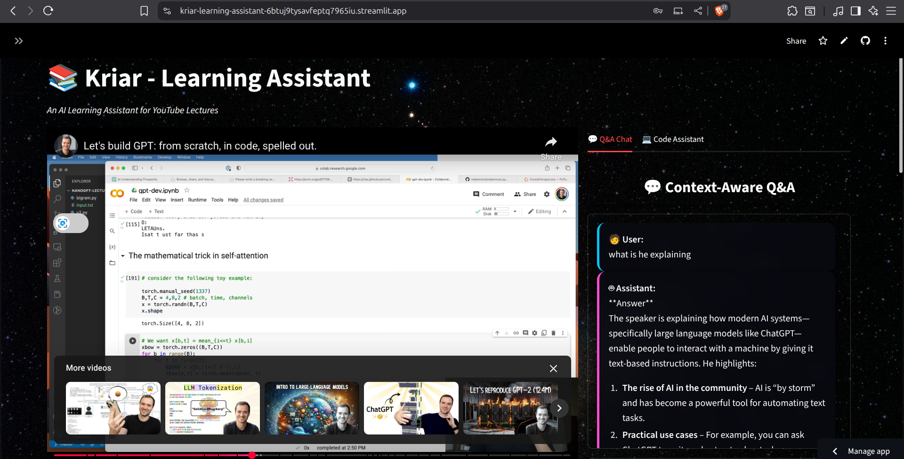
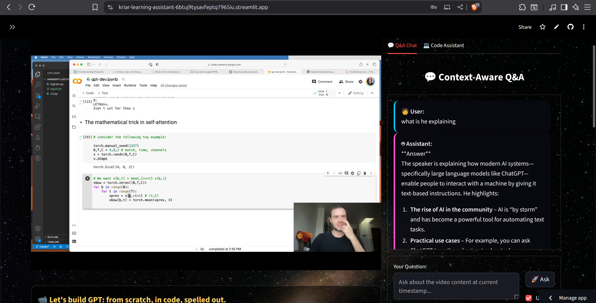

# Kriar-Learning Assistant

A context-aware AI learning assistant that extracts relevant content from YouTube videos based on timestamps and provides intelligent Q&A capabilities.
👉 **Try the hosted app here:** [Kriar-Learning-Assistant (Streamlit)](https://kriar-learning-assistant-6btuj9tysavfeptq7965iu.streamlit.app/)  

## Features

- 🎥 YouTube video integration with transcript extraction
- 🎯 Timestamp-based context extraction 
- 🤖 AI-powered Q&A using video context
- 💻 Code assistance and review
- 📊 Session tracking and statistics
- 🔧 Multiple AI model provider support (OpenAI, Groq, Google)

## How to get Groq API Key for Free: https://www.youtube.com/watch?v=TTG7Uo8lS1M

## How to Use:
[](https://drive.google.com/file/d/1vV6CIV5QWb-7QZbRp_zyDId5mApnQhNt/view?usp=sharing)
## Setup Instructions

### 1. Install Dependencies
```bash
pip install -r requirements.txt
```

### 2. Environment Setup
1. Copy `.env.template` to `.env`
2. Add your API keys for the model providers you want to use:
   - For OpenAI: Add your API key to `API_KEY`
   - For Groq: Add your API key to `GROQ_API_KEY`  
   - For Google AI: Add your API key to `GOOGLE_API_KEY`

### 3. Run the Application
```bash
streamlit run app.py
```

The application will open in your browser at `http://localhost:8501`

## Usage Guide

### 1. Load a Video
- Enter a YouTube URL in the video section
- Click "Load Video" to extract the transcript
- Wait for the success message confirming transcript extraction

### 2. Ask Questions
- Go to the Q&A Chat tab
- Ask questions about the video content
- The AI will use the context from timestamp to provide accurate answers
- Check "Use current timestamp" to automatically include timestamp context

### 3. Get Code Help
- Use the Code Assistant tab for programming questions
- Enter code in the text area
- Use "Review Code" or "Get Help" buttons for AI assistance

## Key Components

- `app.py`: Main Streamlit application with UI and session management
- `model.py`: AI model wrapper supporting OpenAI, Groq, and Google AI
- `context_extractor.py`: YouTube transcript extraction and timestamp-based context analysis
- `agent.py`: LangGraph-based AI agent for intelligent, context-aware responses
- `tools.py`: Additional tools for Wikipedia search

## How It Works

1. **Video Loading**: The system extracts the full transcript from YouTube videos
2. **Timestamp Context**: When you set a timestamp, it finds relevant transcript segments around that time
3. **Context-Aware Responses**: The AI agent uses this specific context to answer your questions
4. **Smart Integration**: All components work together through LangGraph workflows

## Architecture

The application uses LangGraph to create a stateful AI agent that:
1. Extracts relevant context from video transcripts at specific timestamps
2. Optimizes user queries for better understanding
3. Provides context-aware responses using the video content
4. Integrates with external tools when needed

## Troubleshooting

### Common Issues

1. **"No transcript available"**: Some YouTube videos don't have transcripts
2. **API Key Errors**: Make sure your `.env` file has valid API keys
3. **Import Errors**: Run `pip install -r requirements.txt` to install all dependencies
4. **Video Loading Issues**: Check that the YouTube URL is valid and the video is public

### Quick Fixes

- Refresh the Streamlit page if you encounter session state issues
- Check your internet connection for API calls
- Verify that your API keys have sufficient credits/quota
- Try a different YouTube video if transcript extraction fails

## Model Providers

### OpenAI
- Requires: OpenAI API key
- Models: GPT-3.5-turbo, GPT-4, etc.
- Set `API_KEY` in your `.env` file

### Groq
- Requires: Groq API key
- Fast inference with various open-source models
- Set `GROQ_API_KEY` in your `.env` file

### Google AI
- Requires: Google AI API key  
- Models: Gemini and other Google AI models
- Set `GOOGLE_API_KEY` in your `.env` file

## Contributing

1. Fork the repository
2. Create a feature branch
3. Make your changes
4. Test thoroughly
5. Submit a pull request

## License

This project is open source and available under the MIT License.

## Support

If you encounter any issues or have questions, please check the troubleshooting section above or create an issue in the repository.
